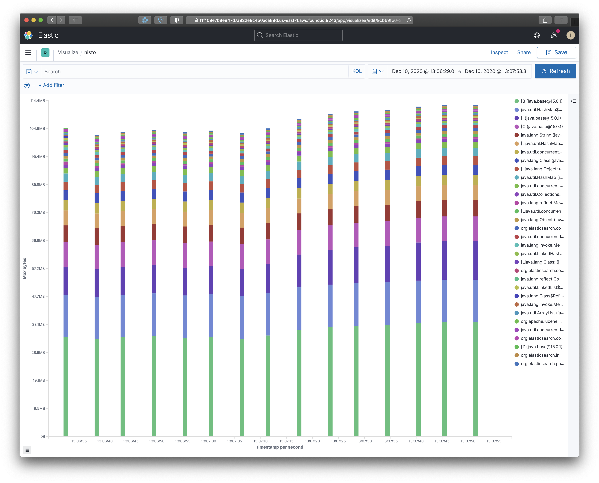

## jhhi

Java Heap Histogram Ingest



## Install

Either 

### Usage

Create some histos for the Java process at `$JAVA_PID` and ingest them:

```bash
while true; do
    jmap -histo:live,file=$(date +%Y-%m-%dT%T%z) $JAVA_PID
    sleep 5
done
```

```shell
jhhi\
  --dir ~/Desktop/histograms_busy \
  --api-key-id REDACTED \
  --api-key REDACTED \
  --cloud-id REDACTED

Histograms will be indexed into [jheap-histo-ingest_2020-12-10t04-11-48.108146+00-00]
Opening dir ["/Users/lloyd/Desktop/histograms_busy"]
Parsed ["/Users/lloyd/Desktop/histograms_busy/2020-12-10T04:06:37+0000"] as histogram, sending ...
  [00:00:11] ########################################   14324/14324   Done
Parsed ["/Users/lloyd/Desktop/histograms_busy/2020-12-10T04:07:16+0000"] as histogram, sending ...
  [00:00:11] ########################################   14393/14393   Done
Parsed ["/Users/lloyd/Desktop/histograms_busy/2020-12-10T04:07:00+0000"] as histogram, sending ...
  [00:00:10] ########################################   14387/14387   Done
Parsed ["/Users/lloyd/Desktop/histograms_busy/2020-12-10T04:06:31+0000"] as histogram, sending ...
  [00:00:11] ########################################   14400/14400   Done
Parsed ["/Users/lloyd/Desktop/histograms_busy/2020-12-10T04:07:50+0000"] as histogram, sending ...
  [00:00:11] ########################################   14404/14404   Done
Parsed ["/Users/lloyd/Desktop/histograms_busy/2020-12-10T04:07:11+0000"] as histogram, sending ...
  [00:00:10] ########################################   14489/14489   Done
Parsed ["/Users/lloyd/Desktop/histograms_busy/2020-12-10T04:07:45+0000"] as histogram, sending ...
  [00:00:10] ########################################   14403/14403   Done
Parsed ["/Users/lloyd/Desktop/histograms_busy/2020-12-10T04:07:28+0000"] as histogram, sending ...
  [00:00:10] ########################################   14422/14422   Done
Parsed ["/Users/lloyd/Desktop/histograms_busy/2020-12-10T04:06:48+0000"] as histogram, sending ...
  [00:00:10] ########################################   14493/14493   Done
Parsed ["/Users/lloyd/Desktop/histograms_busy/2020-12-10T04:07:33+0000"] as histogram, sending ...
  [00:00:10] ########################################   14405/14405   Done
Parsed ["/Users/lloyd/Desktop/histograms_busy/2020-12-10T04:07:05+0000"] as histogram, sending ...
  [00:00:10] ########################################   14345/14345   Done
Parsed ["/Users/lloyd/Desktop/histograms_busy/2020-12-10T04:07:22+0000"] as histogram, sending ...
  [00:00:11] ########################################   14399/14399   Done
Parsed ["/Users/lloyd/Desktop/histograms_busy/2020-12-10T04:06:54+0000"] as histogram, sending ...
  [00:00:10] ########################################   14482/14482   Done
Parsed ["/Users/lloyd/Desktop/histograms_busy/2020-12-10T04:06:43+0000"] as histogram, sending ...
  [00:00:11] ########################################   14406/14406   Done
Parsed ["/Users/lloyd/Desktop/histograms_busy/2020-12-10T04:07:39+0000"] as histogram, sending ...
  [00:00:10] ########################################   14398/14398   Done
```

Vars can be passed as flags or environment variables; use `--help` to see options.

```shell
jhhi [jheap-histo-ingest] 0.1.0
Ingests Java heap histograms from the jmap util to Elasticsearch

USAGE:
    jhhi [OPTIONS] --dir <dir> --file <file>

FLAGS:
    -h, --help       Prints help information
    -V, --version    Prints version information

OPTIONS:
        --api-key <api-key>          API key auth: API Key [env: JHHI_ES_API_KEY=]
        --api-key-id <api-key-id>    API key auth: API Key Id [env: JHHI_ES_API_KEY_id=]
        --chunk-size <chunk-size>    Ingest bulk size [env: JHHI_ES_BULK_SIZE=]  [default: 500]
        --cloud-id <cloud-id>        Cloud Id for the cluster to send data to [env: JHHI_ES_CLOUD_ID=]
    -d, --dir <dir>                  Directory holding histogram files to ingest. Should be passed if file is not [env:
                                     JHHI_HISTO_DIR=]
    -f, --file <file>                Histogram file to ingest. Should be passed if dir is not [env: JHHI_HISTO_FILE=]
        --index-name <index-name>    Target index name [env: JHHI_ES_INDEX_NAME=]
        --password <password>        Basic auth: password [env: JHHI_ES_PASSWORD=]
        --url <url>                  Url for the cluster to send data to [env: JHHI_ES_URL=]
        --user <user>                Basic auth: username [env: JHHI_ES_USER=]
```
